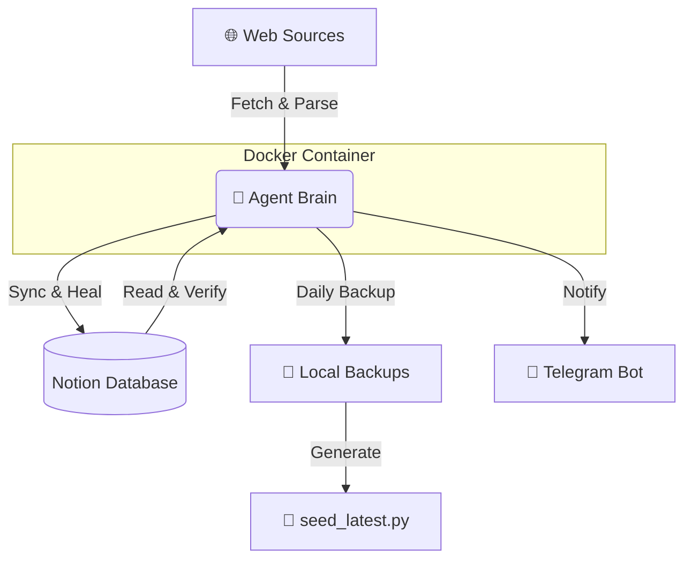

# AI Skills & MCP Knowledge Agent (Notion 版)

> **"Not just a crawler, but a self-healing guardian for your knowledge base."**

这是一个基于 Notion 的自动化知识库管理 Agent。它不仅仅是一个简单的数据同步工具，更是一个具备 **“链接自愈能力”** 和 **“全自动灾备”** 的智能管家。它负责 7x24 小时维护你收集的 AI 编程技巧 (Skills) 和 MCP 工具 (Model Context Protocol)，确保你的知识库永远保持最新、有效。

## 🧠 核心设计哲学 (Design Philosophy)

*   **Source of Truth (唯一真理源)**：Notion 云端数据库是数据的唯一权威来源。所有的增删改查应优先在 Notion 端进行。
*   **Agent 角色 (智能管家)**：Agent 部署在服务器/Docker 中，负责后台巡检、内容同步、死链修复和数据备份。它是无感的，默默工作的。
*   **Local 角色 (本地部署)**：本地代码仅负责部署配置和接收“冷备份”，不作为日常知识管理的入口。

---

## ✨ 核心功能 (Features)

### 1. 🔄 自动巡检与同步 (Auto Sync)
Agent 会周期性（默认每 24 小时）巡检 Notion 数据库：
*   **新条目识别**：当你在 Notion 添加一条只包含 `URL` 的记录时，Agent 会自动访问该链接，抓取网页内容（Markdown），并填入 Notion 的 `Content` 字段。
*   **内容更新**：通过 MD5 校验监测源网页变化，确保 Notion 中的内容与源头保持同步。

### 2. 🔗 链接自愈 (Self-Healing) 🔥
这是本项目的核心特性。当检测到某个 Skill 的 `Source` 链接失效（404 或 DNS 错误）时：
1.  **智能重试**：首先进行多次网络重试。
2.  **全网搜寻**：如果确认为死链，Agent 会调用搜索引擎（DuckDuckGo），结合标题关键词（如 "Title + Github"）寻找新的有效地址。
3.  **自动修复**：
    *   ✅ **找回成功**：自动更新 Notion 中的 URL，保持状态为 `Active`，并发送通知。
    *   ❌ **找回失败**：将状态标记为 `Broken` 或 `Review`，等待人工确认。

### 3. 📦 智能备份与反向播种 (Backup & Reseed)
Agent 每天会自动执行全量备份，确保数据绝对安全：
*   **多格式备份**：在 `backups/` 目录下生成结构化的 `JSON` 数据和易读的 `Markdown` 汇总文件。
*   **反向种子生成 (Reverse Seeding)**：每次备份都会自动生成一个 **可执行的 Python 种子脚本** (`data_seed_latest.py`)。
    *   *魔法之处*：你只需运行这个脚本，即可将当前的 Notion 数据库状态“一键复活”到一个全新的数据库中。

### 4. 🤖 自动发现 (Auto Discovery)
(可选开启) Agent 具备从 cursor.directory 等源头自动发现高质量 Python/AI 编程规则的能力，并将其自动入库待审。

---

## 🛠️ 架构说明



---

## 🚀 快速开始 (Deployment)

### 1. 环境配置
复制环境变量示例文件：
```bash
cp .env.example .env
```
编辑 `.env` 文件，填入你的配置：
*   `NOTION_TOKEN`: Notion Integration Token
*   `NOTION_DATABASE_ID`: 你的 Notion 数据库 ID
*   `TELEGRAM_BOT_TOKEN`: (可选) 用于接收巡检报告
*   `TELEGRAM_CHAT_ID`: (可选) 接收消息的 Chat ID

### 2. Docker 部署 (推荐)
本项目已容器化，支持一键启动，配置了 `Asia/Shanghai` 时区和自动重启策略。

```bash
docker-compose up -d
```
启动后，Agent 将立即开始第一次巡检，随后进入 24 小时循环模式。

### 3. 本地运行 (调试用)
如果你想在本地开发或手动触发一次：

```bash
# 安装依赖
pip install -r requirements.txt

# 启动 Agent (包含巡检、自愈、备份全流程)
python agent_brain.py
```

---

## 📂 目录结构说明

*   `agent_brain.py`: **🧠 大脑核心**。包含主循环、巡检逻辑、自愈算法和 Telegram 通知模块。
*   `agent_notion.py`: **🔧 底层工具**。封装了 Notion API 的调用，实现了智能 Upsert（去重插入）和长文本分片逻辑。
*   `backup_data.py`: **💾 备份模块**。负责拉取 Notion 数据，生成 JSON/Markdown 备份以及“种子脚本”。
*   `data_seed_latest.py`: **🌱 最新种子**。由备份模块自动生成的最新数据快照脚本，可直接运行以恢复数据。
*   `check_schema.py`: **🛡️ 校验工具**。用于检查 Notion 数据库的属性（Schema）是否符合 Agent 的要求。

---

## 📝 使用指南

### 如何添加新技能？
1.  打开你的 Notion 数据库。
2.  点击 **New**。
3.  填入 **Name** (技能名称) 和 **Source** (URL)。
4.  (可选) 设置 Tag 为 `Skill` 或 `MCP`。
5.  **无需做其他操作**。Agent 会在下一次巡检中自动抓取内容并填入 `Content`，状态会自动变更为 `Active`。

### 如何查看备份？
所有备份文件存储在项目根目录的 `backups/` 文件夹中，按时间戳命名。
*   查看 `skills_YYYYMMDD_HHMM.md` 可获得最佳阅读体验。

### 如何灾难恢复？
如果 Notion 数据被意外清空，或者你想迁移到新的工作区：
1.  确保 `.env` 配置了目标数据库的 ID。
2.  运行根目录下的最新种子脚本：
    ```bash
    python data_seed_latest.py
    ```
3.  所有数据将自动重新写入（播种）到数据库中。

---

## License
MIT
